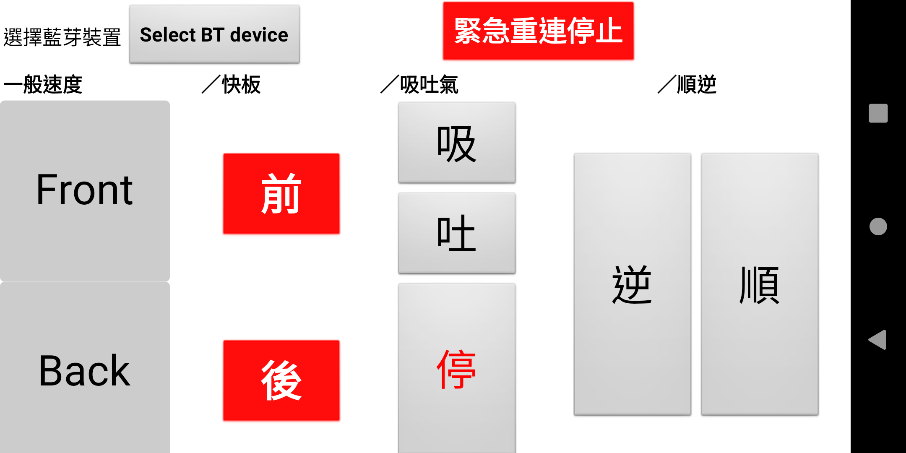
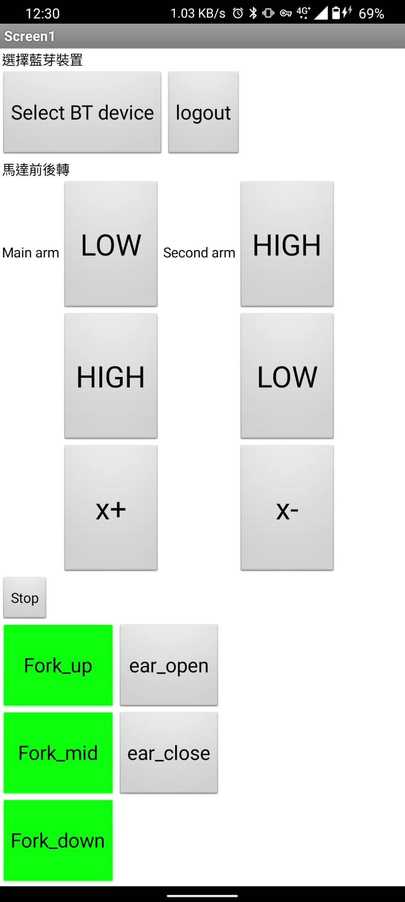

# 2021-NCKU-ME-PROJECT

 
 
2021成大機械大三機械專題實作 - 丙班第三組電控程式碼 - 開源專案
 
 
 
以下相關程式，部分為網路參考而來，我將盡力提供其原始來源。
 
 
 
以下相關資訊，為希望可以為將來的學弟妹在使用Arduino進行電控的時候，可以少走很多冤枉路，節省時間
 
 
 
請注意，這份README.md檔案的著作權並沒有直接採用CC授權，若需引用原創內容，請聯絡我本人轉載；若是有標柱引用來源之內容，則直接採用原作者之相關授權
 

[我們機器人的照片影片](https://ncku365-my.sharepoint.com/:f:/g/personal/e14073190_ncku_edu_tw/Eh9-qopnG3tOvhXfOXTUcdMBlLM40gH2dtHdubfeN2ZXuA?e=c4T7tV)

# 如何開始

  

1.確定要如何進行操控(粗體為我們所採用的方案)

  

- 像是夾物車要使用**Arduino**還是樹梅派(改寫Python)

- 載物車要使用Arduino還是**EV3**

- 因此我們以下有使用到的程式碼僅針對用Arduino寫的夾物車

  

2.先認識會使用到的控制面板們

  

-  **Arduino UNO跟MEGA**為最有可能使用的操控方案，UNO的腳位較少但其對電腦及其他電路板驅動較好，MEGA腳位較多但因為幾乎都是非公版所以其對電腦及其他版的驅動性較差(像我們就遇到只有第一次對電腦僅用ISB連線才能燒錄、無法使用HC05模組；但同時別組卻沒遇到這種問題)

- 控制直流馬達，清一色都會選用**L298N**，但要注意它很容易燒掉(我們燒了2片)

- 控制伺服馬達，可以直接連Arduino上的PWM腳位(通常是有標示~的)；若要同時控制多個伺服馬達，會建議購買**PCA9685**進行控制(但他採用I2C連接)

- 控制步進馬達，會需要再購買其他的驅動盒(如TB6600)；抑或是有教學說可以用L298N進行控制，但我沒有成功過，且**L298N有輸出電壓不對稱的問題**

- 使用藍芽連接，建議HC05

- 使用PS2手把連接，很抱歉我們沒這麼做，無法提供意見及技術支援

- 強烈建議從電池接電出來一定要走降壓板，我們用的是**LM2596**

- 強烈建議Arduino及藍芽模組一定要走獨立供電確保穩定性，並且要好好的固定好

- 強烈建議隨時準備好三用電表，看得到的數值會比較放心，也比較好debug問題在哪

  

3.粗算會使用到的控制腳位，決定要用UNO或MEGA哪種主控板

4.板子來了之後，開始寫一些簡單的程式做練習，通常會先進行HC05的連線程式，並進行AT設定；AT設定只要設定好後是跟著HC05走，所以不用每次都重設。如果這階段採用MEGA發現沒辦法跟HC05連線的話，就要採用UNO+MEGA的I2C連線模式了

5.**接地很重要，很多時候不會動是忘了接地或接錯地！**

6.決定好操作模式後，就要來寫用手機操控的app；礙於藍芽版本問題，HC05僅能跟安卓手機連線；建議直接使用App inventor進行apk撰寫會方便很多

7.加油，debug很煩，記得買乖乖XD

  

## 我們所使用的控制原理

從手機按下按鈕，藉由手機的藍芽發出一個字元給UNO，UNO接受到字元後採用switch case將字元用I2C連線的方式傳送給MEGA，MEGA再走Switch case來控制各路馬達。

  

## 採買電子材料會用到的店家

  
 
 
我這裡偷偷公開我們的收支明細，可以直接由此檔案去追朔我們在哪裡採購了哪些材料，我們將不會維護這個檔案裡面所有連結的有效性。
 
 
 
阿離成大近且還可以報統編的，我最常去的是TNA168啦
 

  

-[機專收支Github用.xlsx](%E6%A9%9F%E5%B0%88%E6%94%B6%E6%94%AFGithub%E7%94%A8.xlsx)

  

## 寫到一半突然想到要提醒的事項

- L298N有輸出電壓不對稱的問題，務必用三用電表進行數值微調，要不然會走的歪歪的

  
  

## 所使用到的教學文章(有留檔紀錄)

  

 - [兩個Arduino進行I2C連接](https://hugheschung.blogspot.com/2018/05/arduino-i2c1arduino.html)
 - [AT指令1(HC-05藍芽模組的設定)](https://blog.cavedu.com/2017/10/18/hc05-hc06/)
 -  [AT指令2(HC-05藍芽模組的設定)](https://livingtech.education/2018/06/03/arduino%e5%af%a6%e7%94%a8-hc-05-at-mode%e4%b8%bb%e5%be%9e%e9%85%8d%e5%b0%8d/)
 - [最基礎的用L298N控制馬達(測試用)](https://sites.google.com/site/zsgititit/home/arduino/arduino-shi-yongl298n-qu-dong-liang-ge-ma-da)
 - 比較進階的用L298N控制馬達(找不到紀錄已不可考QAQ)
 - [單一伺服馬達測試用](http://programmermagazine.github.io/201312/htm/article1.html)
 - [PCA9865測試用程式碼](https://atceiling.blogspot.com/2019/10/arduino74pca9685servo.html)
 - 步進馬達的控制(請連絡鄭博文XD)
 - [Adafruit_PWMServoDriver.h 這個標頭檔，請從此下載](https://github.com/adafruit/Adafruit-PWM-Servo-Driver-Library)
 - [Arduino安裝自定義資料庫(像上面那個)](https://skybow.pixnet.net/blog/post/106036427)

# Arduino原始碼

 我們沒有很認真寫註解，所以若有問題想詢問，請準確告知我是哪行程式碼。
 
 
 
底盤及吸氣馬達，是採用前面所說的I2C，藍芽的訊號是藉由HC05傳送給UNO，再由UNO藉由I2C連線傳送給MEGA進行控制 

 - [底盤及吸氣馬達_UNO.ino](https://github.com/CrazyRyan0812/2021-NCKU-ME-PROJECT/blob/main/%E5%BA%95%E7%9B%A4%E5%8F%8A%E5%90%B8%E6%B0%A3%E9%A6%AC%E9%81%94_UNO.ino "底盤及吸氣馬達_UNO.ino")
 - [底盤及吸氣馬達_MEGA.ino](https://github.com/CrazyRyan0812/2021-NCKU-ME-PROJECT/blob/main/%E5%BA%95%E7%9B%A4%E5%8F%8A%E5%90%B8%E6%B0%A3%E9%A6%AC%E9%81%94_MEGA.ino "底盤及吸氣馬達_MEGA.ino")
 
手臂控制器，是直接藉由HC05傳送給UNO後進控制
 - [手臂及伺服馬達_UNO.ino](https://github.com/CrazyRyan0812/2021-NCKU-ME-PROJECT/blob/main/%E6%89%8B%E8%87%82%E5%8F%8A%E4%BC%BA%E6%9C%8D%E9%A6%AC%E9%81%94_UNO.ino "手臂及伺服馬達_UNO.ino")

  

# App Inventor相關aia及apk

  

採用比較複雜的框架，且為橫式的寫法

- [底盤及吸氣馬達操作app.aia](https://github.com/CrazyRyan0812/2021-NCKU-ME-PROJECT/blob/main/%E5%BA%95%E7%9B%A4%E5%8F%8A%E5%90%B8%E6%B0%A3%E9%A6%AC%E9%81%94%E6%93%8D%E4%BD%9Capp.aia "底盤及吸氣馬達操作app.aia")
 

採用單一框架，且為直式寫法

- [手臂及伺服馬達操作app.aia](https://github.com/CrazyRyan0812/2021-NCKU-ME-PROJECT/blob/main/%E6%89%8B%E8%87%82%E5%8F%8A%E4%BC%BA%E6%9C%8D%E9%A6%AC%E9%81%94%E6%93%8D%E4%BD%9Capp.aia "手臂及伺服馬達操作app.aia")
 
  

**你可以直接下載這理的aia後上傳進行改寫！**

  

## App Inventor的一些小技巧

 - 右上角的Designer/Block是切換設計頁面跟程式碼頁面
 - 按住、放開的功能是這裡實現的
   

# 聯絡我
若學妹(ㄉㄧˋ)有需要幫忙的，請發送[messenger](https://www.facebook.com/Ryan.Lee.0812.monkey/)給我，我會視情況給予幫助及聯絡。
 
 
 
CrazyRyan員外
 
 
 
2022.02.14 修訂3板
 
